# Chapter 1: Introduction

*人工智能*（*Artificial intelligence*）或者AI被关注于构建模仿智能行为的系统。它包括了广泛的，例如那些基于逻辑的、查找的和概率推理的方法。*机器学习*（*Machine learning*）是AI的一个子集，它通过对拟合可观测的数据的数学模型学习而再做决策。这一领域已出现爆发式的增长，并且如今几乎已成为AI的同义词。

*深度神经网络*（*deep neural network*）是机器学习的一种类型。当深度网络去拟合数据时，这种模式被称为*深度学习*（*deep learning*）。在撰写本文时，深度网络已经是最强大和实用的机器学习模型，并且已经融入我们的日常生活中。诸如利用*自然语言处理*（*natural language processing*）算法将文本翻译成另外一种语言，利用计算机视觉系统在互联网中搜索某一特定物体的图像，或者利用语音识别界面与数字助手进行交流，以上这些事情都是不足为奇的了。所有这些应用都是由深度学习驱动的。

正如书名所示，本书旨在帮助刚进入这一领域的读者了解深度学习背后的原理。本书既没有可怕的理论（没有证明），也没有极其实用的内容（几乎没有代码）。我们的目标是解释基本的想法；在阅读完这本书后，读者将能够把深度学习应用到没有现有成功秘诀的新情况中。

机器学习方法可以被粗糙的划分为三个领域：监督学习，无监督学习和强化学习。在撰写本文时，这三个领域的前沿方法都依赖于深度学习（图1.1）。本介绍性章节高度描述了这三个领域，这种分类法也松散地反映在本书的组织结构中。

## 1.1 监督学习

监督学习模型定义了一个从输入数据到输出预测的映射。在接下来的章节中，我们讨论输入、输出、模型本身和什么叫做“学习“模型。

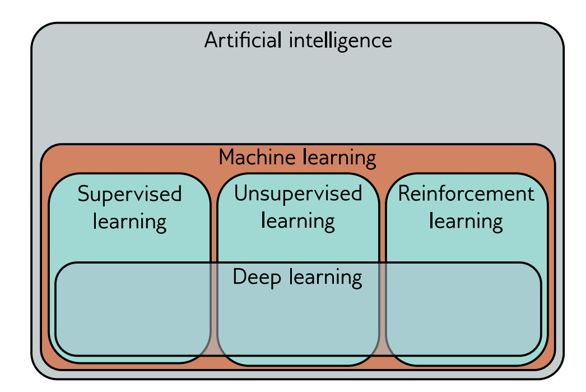

**图 1.1** *机器学习是人工智能的一个领域，它将数学模型与观察到的数据相结合。它可以粗略地分为监督学习、无监督学习和强化学习。深度神经网络对这些领域都有贡献。*

### 1.1.1 回归和分类问题

图1.2描述了几个回归和分类问题。在每一个例子中，都存在一个有意义的现实世界的输入（例如一句话、一个音频文件、一张图片等）被编码为一个数字向量。这个向量构成了模型的输入，模型将输入映射到一个输出向量，然后翻译为一个有意义的现实世界的预测。现在我们关注于输入和输出，把模型当做一个黑盒，接收一个数字向量并返回为另一个数字向量。

图1.2a中的模型基于平方英尺和卧室的数量等输入的特征来预测房屋的价格。这是一个*回归*（*regression*）问题因为模型返回了一个连续的数字而不是一个类别分配。相反，模型在图1.2b中奖分子化学结构作为输入，从而预测它的熔点和沸点。由于它预测的数字不止一个所以这是一个*多元回归*（*multivariate regression*）问题。

图1.2c的模型接收到了一个包含餐厅评价的字符串文本作为模型的输入，并预测该评论的正面性和负面性。这是一个*二元分类*（*binary classification*）问题因为模型企图将输入的内容分配给两个类别中的一个（判断当前输入属于哪个类别）。输出向量包含每个类别的选择概率。图1.2d和图1.2e描述了多分类问题，模型在这里将输入分配到多个类别（N＞2，其中N代表类别个数）中的一个。在第一个例子中，输入的是一个音频文件，模型预测它属于哪种流派的音乐。在第二个例子中，输入的是一张图片，模型预测它包含哪一种物体。在每一个例子中，模型返回一个大小为N的向量，每个向量中包含N个类别的概率。

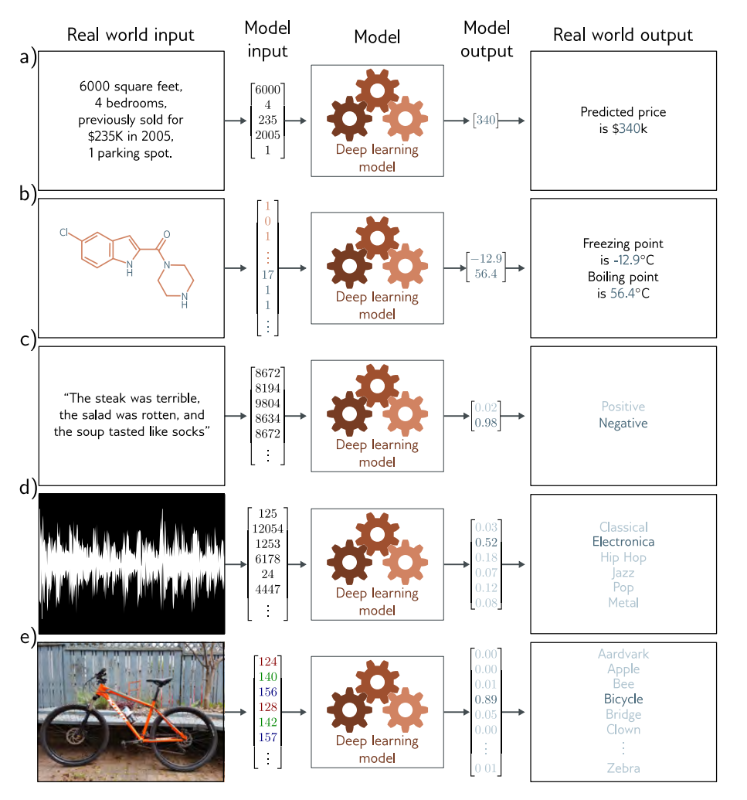

**图1.2** *回归和分类问题。 a) 这个回归模型采用一个描述财产特征的数字向量，并预测其价格。 b) 这个多元回归模型采用一个化学分子的结构，并预测其熔点和沸点。c) 这个二元分类模型取一个餐馆的评论，并将其分类为正面或负面。 d) 这个多类分类问题将一个音频片段分配给N个流派中的一个。*

### 1.1.2 输入

图1.2中的输入数据差别很大。在房屋定价的例子中，输入是一个包含描述房产特征的数值的固定长度向量。因为它没有内部结构，所以这是一个*表格数据*（*tabular data*）的例子；如果我们改变输入的顺序并建立一个新的模型，那么我们期望模型的预测值保持不变。

相反，餐厅评论例子中的输入是一个文本主体。它可能取决于字数不同长度的评论，并且输入的顺序也是很重要的；*我的妻子吃了鸡*（*my wife ate the chicken*）不等于*鸡吃了我的妻子*（*the chicken ate my wife*）。在将文本传递给模型之前，必须将其编码为数字形式。在这里，我们使用一个大小为10000的固定词汇表，并简单地将单词索引连接起来。

对于音乐分类的例子，输入向量可能是固定大小的（可能是10秒钟的片段），且是非常高维度的。数字音频通常以44.1千赫采样，用16位整数表示，因此10秒钟的片段由441，000个整数组成。很明显，监督学习模型必须能够处理相当大的输入。图像分类例子中的输入（由每个像素的RGB值串联而成）也很庞大。此外，它的结构自然是二维的；彼此上下的两个像素是密切相关的，即使它们在输入向量中并不相邻。

最后，考虑预测分子的熔点和沸点的模型的输入。一个分子可能包含不同数量的原子，这些原子可以用不同的方式连接。在这种情况下，模型必须将分子的几何结构和组成原子都获取到模型本身中。

### 1.1.3 机器学习模型

到目前为止，我们一直把机器学习模型当作一个黑盒，它接受一个输入向量并返回一个输出向量。但这个黑盒里到底有什么呢？考虑一个根据孩子的年龄来预测其身高的模型（图1.3）。机器学习模型是一个数学方程，描述了平均身高是如何随年龄变化的（图1.3中的青色曲线）。我们可以通过这个数学方程运行年龄来获取身高。例如，如果年龄是10岁，那么我们预测身高将是139厘米。

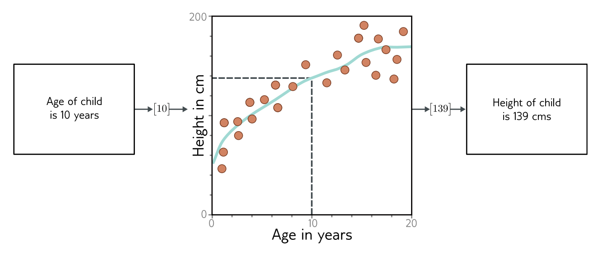

**图1.3** *机器学习模型代表了将输入（孩子的年龄）与输出（孩子的身高）联系起来的关系系列。特定的关系是通过训练数据选择的，这些数据由输入/输出对（橙色点）组成。当我们训练模型时，我们在可能的关系中寻找一个能很好描述数据的关系。训练后的模型是青色的曲线，可以用来计算任何年龄段的身高。*

更确切地说，该模型代表了将输入与输出进行映射的方程系列（即不同青色曲线系列）。特定的方程（曲线）是通过训练数据（输入/输出对的例子）选择的。在图1.3中，这些对由橙色的点代表，我们可以看到模型（青色的线）合理地描述了这些数据。当我们谈论*训练*（*training*）或*拟合*（*fitting*）模型时，我们的意思是，我们在与输入和输出有关的可能方程系列（可能的青色曲线）中进行搜索，以找到最准确地描述训练数据的那一条。

因此，图1.2中的模型需要标记的输入/输出对进行训练。例如，音乐分类模型需要大量的音频片段，由人类专家来确定每个片段的类型。这些输入/输出对在训练过程中起着教师或监督者的作用，这就产生了*监督学习*（*supervised learning*）这一术语。

### 1.1.4 深度神经网络

本书涉及深度神经网络，它是一种特别有用的机器学习模型。它们是可以代表输入和输出之间极其广泛的关系系列的方程，而且在这个系列中寻找描述训练数据的关系特别容易。

深度神经网络可以处理非常大的输入，长度可变，并包含各种内部结构。它们可以输出单个实数（回归）、多个数字（多元回归）或两个或多个类别的概率（分别为二元和多类别分类）。正如我们将在下一节看到的，它们的输出也可能非常大，长度可变，并包含内部结构。可能很难想象具有这些特性的方程，读者现在应该努力暂停怀疑。

### 1.1.5 结构化输出

图1.4a描述了一个用于语义分割的多元的二元分类模型。输入图像的每个像素都被分配了一个二进制标签，表明它是属于牛还是属于背景。图1.4b显示了一个多元回归模型，其输入是一个街道场景的图像，输出是每个像素的深度。在这两个例子中，输出都是高维度和结构化的。然而，这种结构与输入密切相关，这一点可以被利用；如果一个像素被标记为 “牛”，那么具有类似RGB值的邻居可能具有相同的标签。

图1.4c、图1.4d和图1.4e描述了三个模型，其中输出中存在一个与输入没有那么紧密的联系的复杂结构。图1.4c显示了一个模型，其中输入是一个音频文件，输出是该文件的转录词。图1.4d是一个翻译模型，其中输入的是英文文本，输出的是法文翻译。图1.4e描述了一个非常有挑战性的任务，其中输入时描述性文本，模型必须产生一个与此描述相符的图像。

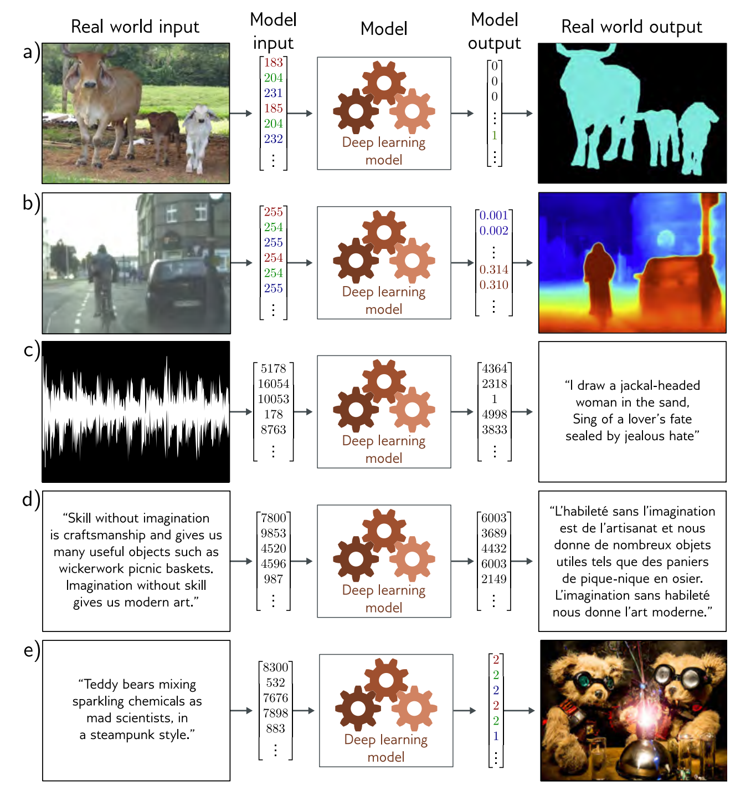

**图1.4** *具有结构化输出的监督学习任务。 a) 这个语义分割模型将RGB图像映射为二进制图像，表明每个像素是属于背景还是奶牛（改编自Noh等人 [1]）。b) 这个单眼深度估计模型将一个RGB图像映射到一个输出图像，其中每个像素代表深度（改编自Cordts等人 [2]）。c) 这个音频转录模型将一个音频样本映射到音频中的口语转录。 d) 这个翻译模型将一个英语文本字符串映射到其法语翻译。 e) 这个图像合成模型将一个标题映射到一个图像（例子来自[https://openai.com/dall-e-2/](https://openai.com/dall-e-2/)）。在每种情况下，输出都有一个复杂的内部结构或语法。在某些情况下，许多输出与输入是兼容的。*

原则上，后三个任务可以再标准的监督学习框架中解决，但是由于两个原因使他们更难解决。第一点，输出结果可能真的是模糊的；从一个英语句子到一个法语句子有多种有效的翻译，而且有多种图像与任何标题相匹配。第二点，输出包含相当多的结构；并非所有的词串都能构成有效的英语和法语句子，也并非所有的RGB值集合都能构成合理的图像。除了学习映射之外，我们还必须尊重输出的“语法”。

幸运的是，这种“语法”可以在不需要输出标签的情况下学习。例如，我们可以通过学习大型文本数据语料库的统计数据来学习如何形成有效的英语句子。这就与本书的下一节提供了联系，该节考虑了*无监督学习模型*（*unsupervised learning models*）。

## 1.2 无监督学习

构建一个没有相应输出标签的输入数据的模型被称为*无监督学习*（*unsupervised learning*）；没有输出标签意味着不可能有“监督”。与其说是学习从输入到输出的映射，不如说是为了描述或理解数据的结构。至于监督学习，数据可能有非常不同的特征；它可能是离散的或连续的，低维的或高维的，长度恒定的或可变的。

### 1.2.1 生成模型

这本书关注于*生成式无监督模型*（*generative unsupervised models*），这些模型学习生成新的在统计上与数据训练没有区别的数据样本。一些生成模型明确表述了输入主体的分布概率，这里的新例子是通过分布中抽样产生的。其他的仅仅是学习一种生成新例子的机制。

最先进的生成模型可以合成极为合理但又不同于训练实例的例子。它们在生成图像（图1.5）和文本（图1.6）方面特别成功，还可以在某些输出是预先确定的约束条件下合成数据（称为*条件合成*（*conditional synthesis*））。这方面的例子包括图像绘画（图1.7）和文本完成（图1.8）。事实上，现代的文本生成模型是如此强大，以至于它们可以显得很聪明。给出一段文字，后面是一个问题，模型通常可以通过生成最可能的文档完成度来“填补”缺少的答案。然而在现实中，该模型只知道语言的统计，并不了解其答案的意义。

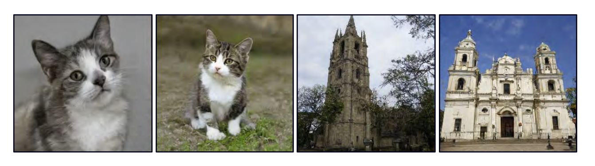

**图1.5** *图像的生成模型。左图：两个图像是由一个在猫的图片上训练的模型生成的。这些不是真正的猫，而是来自一个概率模型的样本。右图：两幅图像是由一个在建筑物图片上训练的模型生成的。改编自Karras等人 [3]。*

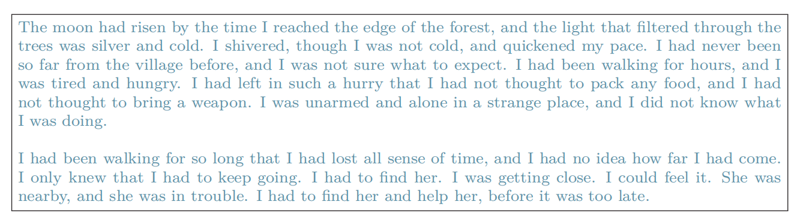

**图1.6** *从文本数据的生成模型中合成的短篇故事。该模型描述了一个概率分布，为每个输出字符串分配了一个概率。从该模型中取样，可以创造出以前从未见过的遵循训练数据*（*这里是短篇小说*）*的统计数据字符串。*

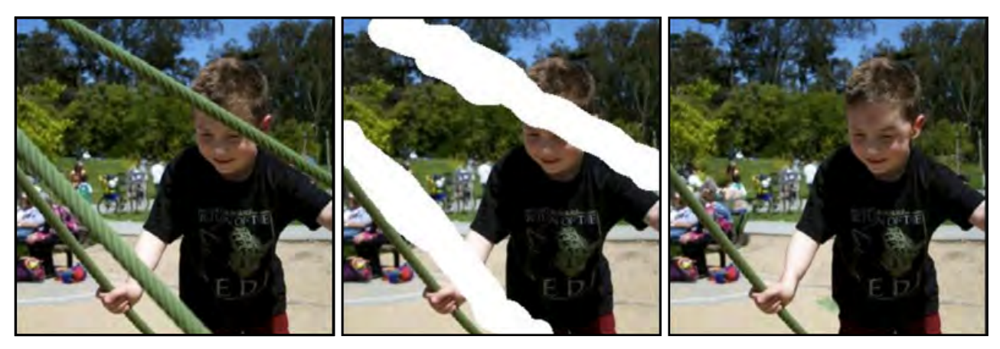

**图1.7** *图像修复。原始图像中（左）的男孩被金属缆绳遮挡住了。这些不想要的区域（中间）被移除，在其余像素必须保持不变的约束下，生成模型合成了一个新的图像（右）。改编自Saharia等人[4]。*

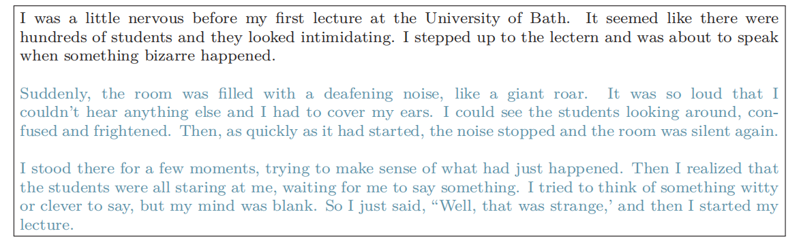

**图1.8** *条件性文本合成。给定一个初始文本体（黑色），文本的生成模型可以通过合成字符串的“缺失”部分来合理地延续该文本。由GPT3*（*Brown等人[5]*）*生成。*

### 1.2.2 隐变量

一些生成模型利用了观察数据可能比观察变量的原始数量所表明的维度更低的观察结果。例如，有效和有意义的英语句子的数量要比随机抽出的单词所产生的字符串的数量小得多。同样地，现实世界的图像是通过为每个像素随机绘制RGB值来创建的图像的一个很小的子集。这是因为图像是由物理过程产生的（图1.9）。

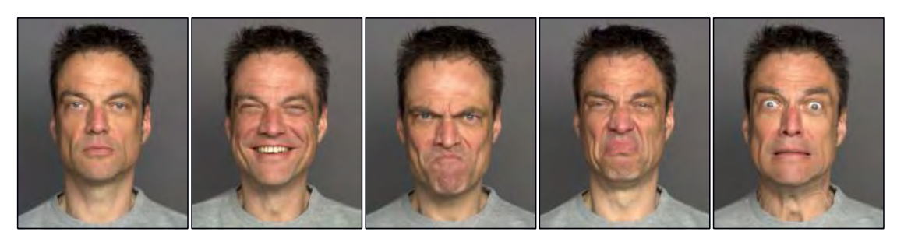

**图1.9** *多样的人脸变化。人的面部大约包含42块肌肉，所以只用42个数字就可以描述同一个人在相同灯光下的大部分变化。一般来说，图像、音乐和文本的数据集可以用相对较少的基础变量来描述，尽管通常比较难以将这些变量与特定的物理机制联系起来。图片来自动态FACES数据库*（*Holland等人[6]*）*。*

这导致了我们可以用较少的基础*隐变量*（*latent variables*）来描述每个数据实例的想法。深度学习在这里的作用是描述这些隐变量和数据之间的映射关系。隐变量一般有一个简单设计的概率分布。通过从这个分布中取样并将结果传递给深度学习模型，我们可以创建新的样本（图1.10）。

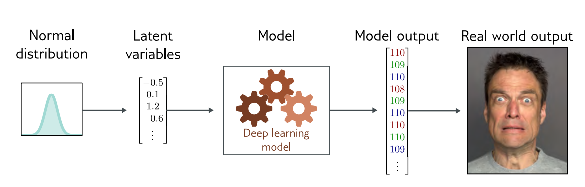

**图1.10** *隐变量。许多生成模型使用深度学习模型来描述低维“潜在”变量和观察到的高维数据之间的关系。隐变量在设计上有一个简单的概率分布。因此，新的例子可以通过从隐变量的简单分布中取样，然后使用深度学习模型将样本映射到观察到的数据空间来生成。*

这些模型导致了操纵真实数据的新方法。例如，考虑找到支撑两个真实例子的隐变量，我们可以通过在这些例子的潜表征之间进行插值，并将中间位置映射回数据空间（图1.11）。

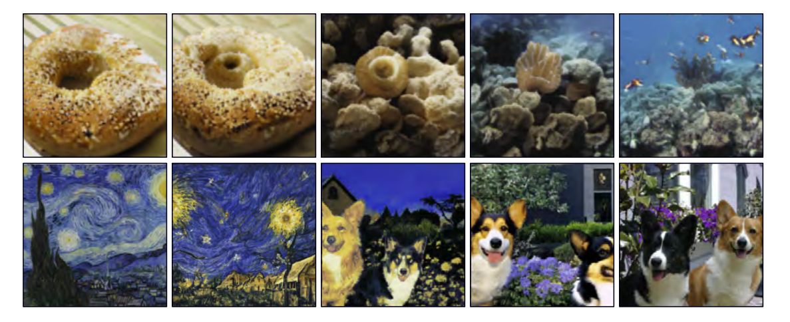

**图1.11** *图像插值。在每一行中，左边和右边的图像是真实的，中间的三幅图像代表了由生成模型创建的插值序列。通过支撑这些插值的生成模型已经得知所有的图像都可以由一组潜在的变量创建。通过找到两个真实图像的这些变量，插入它们的值，然后使用这些中间变量来创建新的图像，我们可以产生既在视觉上可信又混合了两个原始图像的特征的中间结果。上行改编自Sauer等人 [7]。底行改编自Ramesh等人 [8]。*

### 1.2.3 连接监督和无监督学习

具有隐变量的生成模型也可以使输出具有结构的监督学习模型受益（图1.4）。例如，考虑学习预测一个标题所对应的图像。我们可以学习解释文本和解释图像的隐变量之间的关系，而不是直接将文本输入映射到图像上。

这里有三个优点。首先，由于输入和输出的维度较低，我们可能需要更少的文本/图像对来学习这种映射。第二，我们更有可能产生一个看起来很合理的图像；任何合理的潜变量值都应该产生一些看起来很合理的例子。第三，如果我们在两组潜变量之间的映射或从潜变量到图像的映射中引入随机性，那么我们可以生成多个图像，这些图像都能被标题很好地描述（图1.12）。

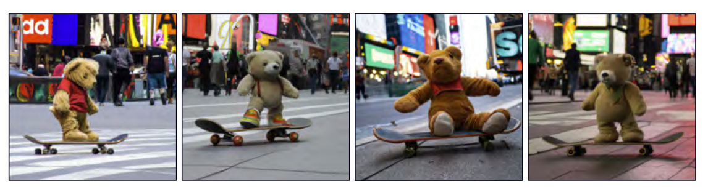

**图1.12** *从标题“时代广场滑板上的泰迪熊”生成的多幅图像。由DALL-E-2*（*Ramesh等人* [8]）*生成。*

## 1.3 强化学习

机器学习的最后一部分是强化学习。这个范式引入了一个代理人的概念，这个代理人生活在一个世界中并在每个时间步骤中可以执行某些行动。这些行动改变了系统的状态，但不一定是以一种确定的方式。采取一项行动后也可以产生奖励，强化学习的目标是这个代理人要学会均衡选择最高回报的行动。

存在一个复杂的问题，那就是奖励可能发生在行动之后的一段时间，因此将奖励与行动联系起来并不直接。这被称为*时间信度分配问题*（*temporal credit assignment problem*）。随着代理人的学习，它必须权衡*探索*（*exploration*）和*利用*（*exploitation*）它已经知道的东西。也许代理人已经学会了如何获得适度的奖励，它应该遵循这个策略（利用它知道的东西），还是应该尝试不同的行动，看看它是否可以改进（探索其他机会）？

### 1.3.1 两个例子

思考一下教一个类人机器人进行运动。这个机器人在给定的时间内可以执行有限次数的动作（移动各种各样的关节部位），这些动作会改变世界的状态（机器人的姿势）。在障碍比赛中我们可能会在机器人到达检查点时奖励它。为了到达每一个检查点，它必须执行很多动作，并且机器人不清楚在收到奖励时那些动作对奖励有贡献，那些动作是不相关联的。这就是一个时间信度分配问题的例子。

第二个例子是学习去下棋。代理人在任何给定的时间内都有一系列有效的行动（下棋动作）。然而这些动作以非决定性的方式改变着系统的状态，对方棋手对于任何行动的选择都可能以许多不同的动作来回应。我们可能会设置一个基于夺取棋子的奖励结构，或者仅仅使用在赢得棋局后使用单一的奖励。在后一种情况中，时间信度分配问题是极端的，系统必须学会哪些它所做的动作对成功或者失败是有帮助的。

探索-利用的权衡在两个例子中也很明显。机器人或许已经发现它们可以通过侧卧或使用一条腿运动来取得进步。这种策略将移动机器人并获得奖励，但比最佳解决方案要慢得多。所以机器人面对选择时利用它已经知道的东西（如何在地上笨拙的滑动）和探索行动空间（这可能导致更快的运动）。在下棋的例子中也有相似的例子，代理人也许学习了一种合理的开局动作序列，那么它应该利用这一知识还是探索不同的开局序列？

如何将深度学习在主动学习框架中融合也许不是显而易见的。有几种可能读方法，但一种技术是使用深度网络来建立从观察到的世界状态到行动的映射。这就是所谓的*策略网络*（*policy network*）。在机器人的例子中，策略网络将学习从其传感器测量到联合运动的映射。在国际象棋的例子中，该网络将学习从棋盘的当前状态到行动选择的映射（图1.13）。

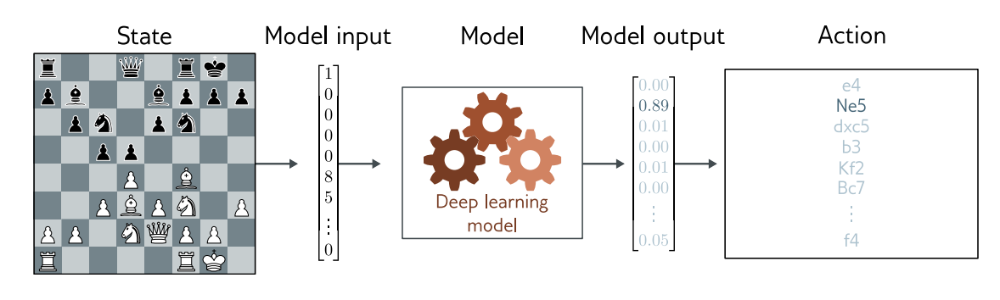

**图1.13** *强化学习的策略网络。将深度神经网络纳入强化学习的一种方法是用它们来定义从状态*（*这里是棋盘上的位置*）*到行动*（*可能的动作*）*的映射。这种映射被称为策略。改编自Pablok [9]*。

## 引用

[1] Noh, H., Hong, S., & Han, B. (2015). Learning deconvolution network for semantic segmentation. IEEE International Conference on Computer Vision, 1520–1528.

[2] Cordts, M., Omran, M., Ramos, S., Rehfeld, T., Enzweiler, M., Benenson, R., Franke, U., Roth, S., & Schiele, B. (2016). The Cityscapes dataset for semantic urban scene understanding. IEEE/CVF Computer Vision & Pattern Recognition, 1877–1901

[3] Karras, T., Laine, S., Aittala, M., Hellsten, J., Lehtinen, J., & Aila, T. (2020b). Analyzing and improving the image quality of StyleGAN. IEEE/CVF Computer Vision & Pattern Recognition, 8110–8119.

[4] Saharia, C., Chan, W., Chang, H., Lee, C., Ho, J., Salimans, T., Fleet, D., & Norouzi, M. (2022a). Palette: Image-to-image diffusion models. ACM SIGGRAPH.

[5] Brown, T., Mann, B., Ryder, N., Subbiah, M., Kaplan, J. D., Dhariwal, P., Neelakantan, A., Shyam, P., Sastry, G., Askell, A., et al. (2020). Language models are few-shot learners. Neural Information Processing Systems, 33, 1877– 1901.

[6] Holland, C. A., Ebner, N. C., Lin, T., & SamanezLarkin, G. R. (2019). Emotion identification across adulthood using the dynamic faces database of emotional expressions in younger, middle aged, and older adults. Cognition and Emotion, 33(2), 245–257.

[7] Sauer, A., Schwarz, K., & Geiger, A. (2022). StyleGAN-XL: Scaling StyleGAN to large diverse datasets. ACM SIGGRAPH.

[8] Ramesh, A., Dhariwal, P., Nichol, A., Chu, C., & Chen, M. (2022). Hierarchical textconditional image generation with CLIP latents. arXiv:2204.06125.

[9] Pablok, J. (2017). Chess pieces and board improved. Wikimedia Commons. Retrieved January 17, 2023. [https://commons.wikimedia.org/wiki/File:Chess_pieces_and_board_improved.svg](https://commons.wikimedia.org/wiki/File:Chess_pieces_and_board_improved.svg).
